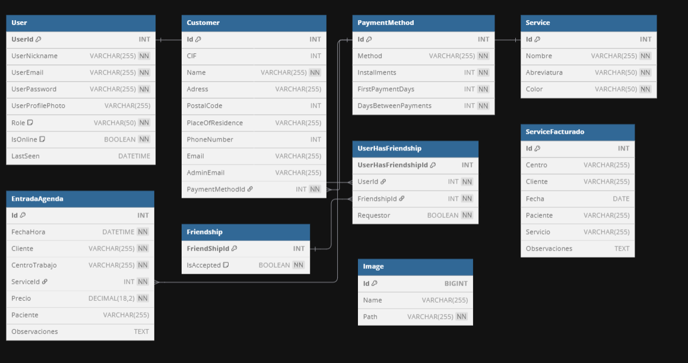

# TFG Sanitarios - Gestión Integral para Profesionales

Trabajo de Fin de Grado de los alumnos Paco Barrionuevo y Jorge Salguero del 2º año del CPIFP Alan Turing en Desarrollo de Aplicaciones Multiplataforma.

- *Enlace al anteproyecto:* [Documento de Google Docs](https://docs.google.com/document/d/1TFJnD-q_kEXWpyvHYLzhxsQBzPGWbPmFwfnIWQeBnkk/edit?usp=sharing)
- *Enlace a los diseños en Figma:* - *Enlace a los diseños en Figma:* [SanitariosApp_Mockup en Figma]([https://www.figma.com/design/Daj4gfSJHqc1angDPg6QIY/SanitariosApp_Mockup?node-id=62-214](https://www.figma.com/design/Daj4gfSJHqc1angDPg6QIY/SanitariosApp_Mockup?node-id=0-1&t=x5xSijR0pW8exEXX-1))

---

## 1. Introducción

*Sanitarios App* es una solución integral diseñada para facilitar la gestión diaria de los profesionales del sector sanitario. El proyecto consiste en una plataforma completa que incluye una aplicación web y una aplicación móvil nativa para Androidque permite proporcionar a los sanitarios una herramienta centralizada para organizar su agenda profesional, gestionar la información de sus clientes y servicios, administrar la facturación y mantener una comunicación fluida con su red de contactos.

## 2. Arquitectura y Tecnologías

El proyecto se estructura en cuatro componentes principales, cada uno desarrollado con tecnologías específicas para optimizar su rendimiento y funcionalidad:

-   *Backend (TFG_Back): Desarrollado con **ASP.NET Core*, sigue una arquitectura por capas utilizando el patrón Repositorio y Unit of Work para una gestión de datos robusta y escalable.
    -   *Base de datos*: SQLite gestionada a través de Entity Framework Core.
    -   *Autenticación*: Sistema basado en JSON Web Tokens (JWT) para proteger los endpoints.
    -   *Tiempo Real: Implementación de **WebSockets* para notificaciones instantáneas, como el estado de conexión de los usuarios y solicitudes de amistad.
    -   *API*: Una API RESTful que sirve como nexo de unión entre el backend y los clientes (web y móvil).

-   *Frontend (TFG_Front): Una Single Page Application (SPA) creada con **Angular*.
    -   *Diseño*: Componentes estructurados por páginas y un layout principal con menú de navegación para una experiencia de usuario coherente.
    -   *Comunicación*: Servicios dedicados para consumir la API del backend y un servicio de WebSocket para la interacción en tiempo real.
    -   *Funcionalidades*: Panel de administración, gestión de agenda, calendario interactivo, sistema de amigos, ficheros y facturación.

-   *Aplicación Móvil (TFG_Movil): App nativa para **Android* desarrollada en *Kotlin* y *Jetpack Compose*.
    -   *Arquitectura*: Sigue el patrón MVVM (Model-View-ViewModel) para una separación clara de responsabilidades.
    -   *Comunicación: Utiliza **Retrofit* para las llamadas a la API y *DataStore* para la persistencia local de credenciales de usuario.
    -   *Enfoque*: Ofrece las funcionalidades esenciales de autenticación y navegación, proporcionando una experiencia optimizada para dispositivos móviles.

-   *Business Intelligence (Informe Power BI.pbix): Un informe interactivo creado con **Power BI* que se conecta a la base de datos de la aplicación para visualizar métricas clave y facilitar la toma de decisiones basada en datos.

## 3. Paleta de Colores y Diseño

La selección de colores de la aplicación se ha realizado con el objetivo de transmitir profesionalidad, confianza y calma, valores fundamentales en el sector sanitario.

-   **Azul (#0077c2, #4498D0, #DCE8F3): Es el color predominante. Psicológicamente, el azul se asocia con la serenidad, la estabilidad y la confianza. Se utiliza en elementos principales, fondos y enlaces para crear un entorno visual limpio y profesional.
-   **Púrpura/Morado (#2a0066, #5f00b2): Utilizado en el menú de navegación, este color aporta un toque de modernidad y sofisticación. Al ser un color menos común, ayuda a diferenciar claramente el área de navegación del contenido principal.
-   **Naranja/Amarillo (#ff9900, #ffcc00): Empleado en botones de acción importantes como "Iniciar Sesión" o "Registrarse". Estos colores cálidos y enérgicos captan la atención del usuario y lo guían hacia acciones clave.
-   **Verde (#28a745): Se usa para indicar acciones exitosas (botones de "Guardar") y estados positivos ("Conectado"), ya que universalmente se asocia con lo correcto y la seguridad.
-   **Rojo (#dc3545): Reservado para acciones destructivas o de advertencia, como los botones de "Eliminar" o "Rechazar", alertando al usuario sobre la importancia de su decisión.

Esta combinación de colores no solo busca un resultado estético agradable, sino que también mejora la usabilidad de la interfaz al crear una jerarquía visual clara y guiar al usuario de forma intuitiva.

## 4. Modelo Entidad-Relación

La base de datos es el núcleo de la aplicación. Su diseño se ha estructurado para garantizar la integridad de los datos y la eficiencia en las consultas. A continuación se muestra el diagrama Entidad-Relación:

#### Entidades Principales:

-   *User*: Almacena la información de los usuarios, incluyendo credenciales para la autenticación y su rol en el sistema (usuario o administrador).
-   *Customer*: Contiene los datos de los clientes del profesional sanitario. Se relaciona con PaymentMethod.
-   *EntradaAgenda*: Representa cada cita o evento en la agenda del usuario. Se vincula con un Service para detallar el tipo de servicio prestado.
-   *Service*: Define los diferentes tipos de servicios que ofrece el profesional, cada uno con su nombre, abreviatura y un color para una fácil identificación visual en la agenda.
-   *Friendship / UserHasFriendship*: Implementan un sistema de amistad (relación N:M entre usuarios), permitiendo a los usuarios conectar entre sí y ver su estado de conexión en tiempo real.
-   *ServiceFacturado*: Una tabla para registrar los servicios que ya han sido procesados para su facturación.

## 5. Funcionalidades Implementadas y Principales

La aplicación ofrece un conjunto de herramientas diseñadas para cubrir las necesidades clave de un profesional sanitario:

-   *Gestión de Usuarios y Autenticación*:
    -   Registro e inicio de sesión seguros mediante JWT.
    -   Sistema de roles (Usuario y Administrador) para controlar el acceso a las diferentes funcionalidades.
    -   Opción de "Recuérdame" para una experiencia de usuario más fluida.

-   *Panel de Administración*:
    -   Dashboard con estadísticas clave (total de usuarios, clientes, servicios, etc.).
    -   Gestión completa de usuarios: editar datos, cambiar roles, modificar avatares y eliminar usuarios.

-   *Módulo de Agenda y Calendario*:
    -   Creación de entradas en la agenda con información detallada: cliente, centro, servicio, precio y observaciones.
    -   Visualización de la agenda en formato de lista cronológica y en un calendario mensual interactivo.
    -   Uso de colores para diferenciar los tipos de servicio de un vistazo.

-   *Gestión de Ficheros*:
    -   CRUD completo para *Servicios, **Métodos de Pago* y *Clientes*, permitiendo una gestión centralizada de la información maestra de la aplicación.

-   *Módulo Social y Comunicación en Tiempo Real*:
    -   Sistema de amigos: enviar, aceptar y rechazar solicitudes.
    -   Lista de amigos con indicador de estado (conectado/desconectado) y última hora de conexión, actualizado en tiempo real mediante WebSockets.
    -   Buscador de usuarios para añadir nuevos contactos.

-   *Facturación y Reportes*:
    -   Selección de entradas de la agenda para agruparlas y facturarlas.
    -   (En desarrollo) Generación de facturas en formato PDF a partir de los servicios seleccionados.
    -   Integración con un informe de Power BI para el análisis de datos de la aplicación.
    -   
## 📚 Bibliografía y Recursos Específicos

Esta sección detalla los recursos técnicos, tutoriales y artículos consultados para implementar las funcionalidades más complejas de la aplicación.

### 1. Calendario Dinámico y Gestión de Fechas (Angular)

La creación de un calendario mensual interactivo requirió una manipulación precisa de fechas y la generación de una estructura de datos para la vista.

-   *Algoritmo para Generar la Matriz del Calendario*:
    -   [Tutorial sobre cómo crear un calendario con JavaScript](https://www.w3schools.com/howto/howto_js_calendar.asp) - Se tomaron como base los conceptos para calcular el primer día de la semana del mes y rellenar los días de los meses anterior y posterior para completar la cuadrícula. La lógica fue adaptada a TypeScript y al ciclo de vida de Angular.

-   **Manipulación del Objeto Date en TypeScript/JavaScript**:
    -   [Guía sobre el Objeto Date en JavaScript (MDN)](https://developer.mozilla.org/es/docs/Web/JavaScript/Reference/Global_Objects/Date) - Referencia esencial para obtener años, meses, días y para realizar cálculos como obtener el último día del mes (new Date(year, month + 1, 0)).

-   *Formateo y Estilos Dinámicos*:
    -   [Guía del DatePipe de Angular](https://angular.dev/api/common/DatePipe) - Para formatear las fechas de manera consistente en la interfaz (ej. 'MMMM yyyy').
    -   [Documentación de [ngClass] y [style]](https://angular.dev/guide/attribute-binding) - Para aplicar estilos dinámicos a los días del calendario, como diferenciar el mes actual, el día de hoy y el color de fondo de los eventos según el tipo de servicio.

### 2. Gestión de Estado en Tiempo Real (Amigos)

El sistema de amigos requería no solo gestionar las relaciones, sino también reflejar su estado de conexión en tiempo real y calcular hace cuánto tiempo se desconectaron.

-   *Cálculo del "Tiempo Transcurrido" (Last Seen)*:
    -   [Algoritmo "Time Ago" en JavaScript (Stack Overflow)](https://stackoverflow.com/questions/3177836/how-to-format-a-javascript-date) - Se estudiaron varios enfoques para implementar la función getStatusText. La lógica de calcular la diferencia en segundos y convertirla a minutos, horas o días se basa en algoritmos comunes de "tiempo relativo".

-   *Manejo de Fechas en UTC*:
    -   *Backend*: Para evitar inconsistencias horarias entre el servidor y los clientes, se utilizó DateTime.UtcNow en el backend (WebSocketNetwork.cs) al registrar la desconexión.
    -   *Frontend*: Se trabajó con objetos Date en el frontend, que internamente manejan la zona horaria del cliente, asegurando que los cálculos de tiempo relativo fueran correctos para cada usuario.
    -   [Trabajar con Fechas en C# (.NET)](https://learn.microsoft.com/es-es/dotnet/standard/datetime/choosing-between-datetime) - Documentación sobre las diferencias entre DateTime y DateTimeOffset y el uso de UTC.

### 3. Arquitectura WebSocket y Comunicación en Tiempo Real

La implementación de la comunicación en tiempo real fue uno de los pilares del proyecto y presentó varios desafíos de arquitectura.

-   *Gestión de Conexiones en el Backend (ASP.NET Core)*:
    -   [Manejo de Múltiples Clientes WebSocket](https://www.c-sharpcorner.com/article/chatapp-using-websockets-in-asp-net-core/) - Tutorial que sirvió de inspiración para crear un gestor de conexiones (WebSocketNetwork.cs) que mantiene un pool de clientes activos.
    -   [Uso de ConcurrentDictionary<TKey, TValue>](https://learn.microsoft.com/es-es/dotnet/api/system.collections.concurrent.concurrentdictionary-2) - Se utilizó esta estructura de datos para almacenar las conexiones de forma segura para subprocesos, evitando condiciones de carrera al conectar o desconectar usuarios.
    -   [Uso de IServiceScopeFactory en servicios Singleton](https://learn.microsoft.com/es-es/aspnet/core/fundamentals/dependency-injection#service-lifetimes) - Para poder inyectar y utilizar servicios con ciclo de vida Scoped (como UnitOfWork) dentro del gestor de WebSockets, que opera como un Singleton.

-   *Integración de WebSockets en el Frontend (Angular)*:
    -   [Guía de RxJS Subject y BehaviorSubject](https://rxjs.dev/guide/subject) - La arquitectura del WebsocketService en Angular se basa en Subject para emitir los eventos recibidos del servidor y que los componentes puedan suscribirse a ellos de forma reactiva.
    -   [Entendiendo NgZone en Angular](https://angular.dev/guide/zone) - Se utilizó ngZone.run() para asegurar que las actualizaciones recibidas desde el WebSocket (que ocurren fuera del contexto de Angular) disparen correctamente el ciclo de detección de cambios y actualicen la interfaz de usuario.

### 4. Patrones de Arquitectura y Buenas Prácticas

-   *Patrón Repositorio y Unidad de Trabajo (Unit of Work)*:
    -   [Implementación del Patrón Repositorio en ASP.NET Core](https://learn.microsoft.com/es-es/aspnet/mvc/overview/older-versions/getting-started-with-ef-5-using-mvc-4/implementing-the-repository-and-unit-of-work-patterns-in-an-asp-net-mvc-application) - Guía conceptual de Microsoft que sirvió de base para estructurar la capa de acceso a datos (Repository.cs, UnitOfWork.cs).
-   *Inyección de Dependencias en .NET*:
    -   [Inyección de dependencias en ASP.NET Core](https://learn.microsoft.com/es-es/aspnet/core/fundamentals/dependency-injection) - Documentación fundamental para configurar los servicios y repositorios en Program.cs.

## 📌 Estado Actual del Proyecto

-   La estructura general del sistema está implementada y las funcionalidades base de autenticación, gestión de datos y navegación están operativas.
-   La aplicación web y el servidor están en una fase avanzada, con la mayoría de las funcionalidades principales implementadas.
-   El despliegue de la web está en fase final de preparación.
-   La aplicación móvil cuenta con la configuración inicial y las funcionalidades básicas de autenticación, siendo el siguiente foco de desarrollo.
